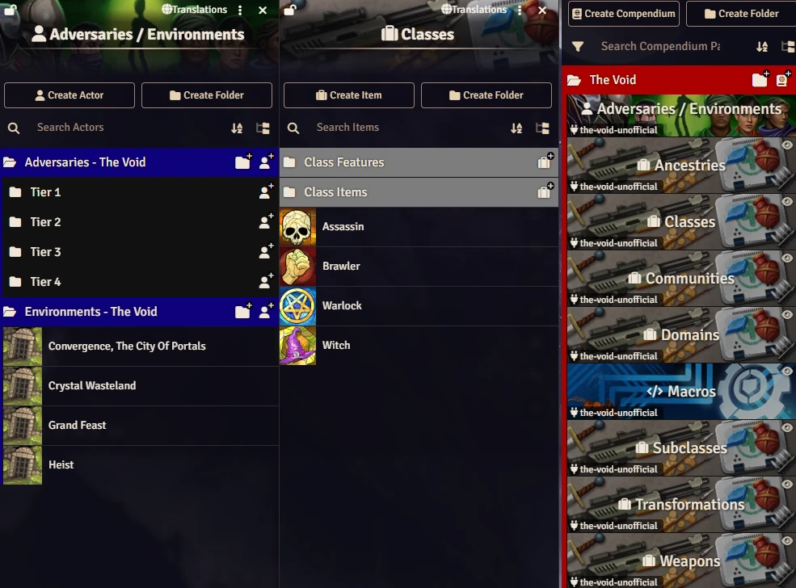

# Daggerheart - Hope and Fear
Modulo nao oficial (fanmade) para o sistema Daggerheart no Foundry VTT, por **Adags**.

<p align="center">
  
</p>

# Instalacao Manual

Va em **Modulos > Instalar Modulo** e cole o link do manifest:

```
https://raw.githubusercontent.com/giovannialopes/daggerheart-hope-and-fear/main/module.json
```

# Changelog
Voce pode ver as mudancas em [CHANGELOG](CHANGELOG.md).

# Creditos e Licenca

- Imagens:
  - Dread: https://unsplash.com/pt-br/fotografias/uma-foto-em-preto-e-branco-de-um-cranio-humano-1PtM6b85sdw
  - Blood: https://unsplash.com/pt-br/fotografias/a-mao-de-uma-pessoa-com-sangue-nela-9KF7A8PJFF8

```
Daggerheart is a trademark of Darrington Press LLC. All original content, mechanics, and intellectual property related to the Daggerheart roleplaying game are (c) Darrington Press LLC. This project is intended for personal or non-commercial use. All rights to Daggerheart's original materials remain with their respective owners.
```

```
For Playtest Materials, no commercial products are permitted in any format, regardless of whether it is a Permitted Format identified above or some other format.
```

Leia mais em [https://darringtonpress.com/license/](https://darringtonpress.com/license/)
